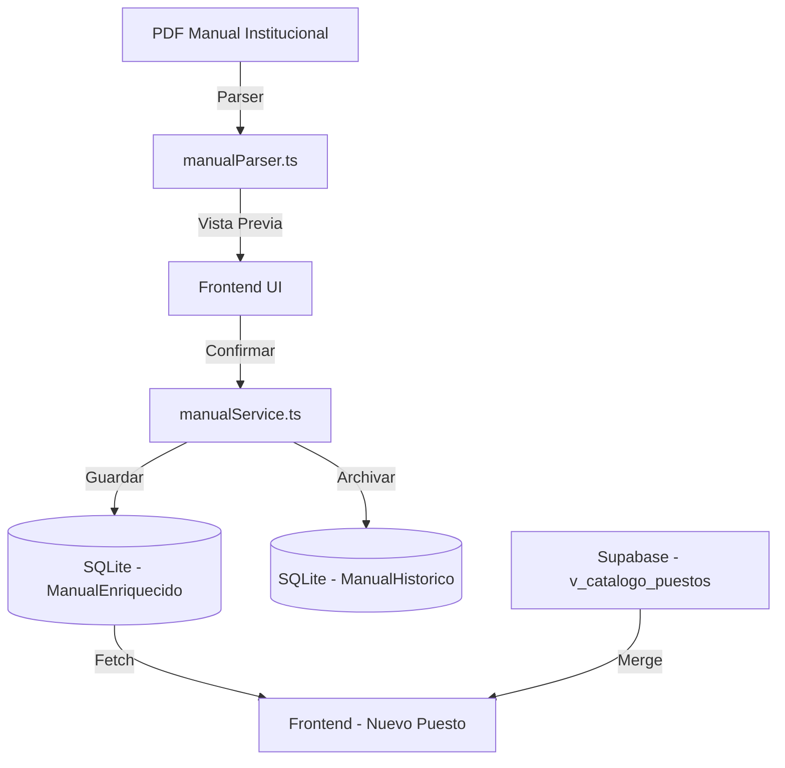

# Checkpoint: Estabilización del Catálogo y Motor de Vinculación
**Fecha:** 6 de mayo de 2026
**Estado:** Estable / Listo para Uso Institucional

## Arquitectura del Catálogo Enriquecido
El sistema ha migrado de un parseo volátil en memoria a una arquitectura de persistencia robusta:

## Logros Técnicos
1.  **Persistencia Local:** El catálogo ya no depende de re-parsear el PDF cada vez. Se carga instantáneamente desde SQLite.
2.  **Motor de Vinculación Inteligente:**
    *   Busca homólogos en Supabase por nombre normalizado.
    *   Si existe en Supabase, extrae la data oficial.
    *   Si no existe, usa la data enriquecida del PDF (funciones detalladas).
3.  **Salud de Datos:**
    *   **Total Cargos:** 726 registros.
    *   **Calidad:** Se eliminó la "suciedad" de la tabla de contenidos y se normalizaron los nombres largos.
    *   **Funciones:** Mantenimiento de saltos de línea y viñetas originales del manual.

## Notas para el Desarrollador
- El archivo `server/src/services/manualService.ts` es el núcleo de la gestión de datos.
- El frontend utiliza `api.get('/manual/vigente')` para alimentar el dropdown de selección.
- En caso de corrupción de datos, se puede revertir usando la tabla `ManualHistorico`.
