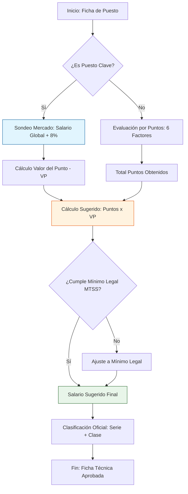

# Metodología de Valoración de Puestos MSC

> **Referencia Legal:** Ley Marco de Empleo Público (Ley 10.159)
> **Ecosistema:** Municipalidad de San Carlos (Tipo A)

## 🏗️ Estructura del Conocimiento

La aplicación utiliza un modelo de **Puntos por Factor** cruzado con el **Salario Global** definido por MIDEPLAN.

### 1. Clasificación por Estratos (Supabase Data)
Basado en los registros oficiales, los puestos se categorizan según el puntaje obtenido:

| Serie | Clase | Rango Puntos |
|---|---|---|
| Operativa | Operativo 1-7 | 135 - 400 |
| Administrativa | Administrativo 1-4 | 225 - 440 |
| Técnica | Técnico 1-3 | 285 - 495 |
| Profesional | Profesional 1-4 | 480 - 595 |
| Jefatura | Jefe 1-5 | 685 - 890 |

### 2. Algoritmo de Cálculo (VP)
El **Valor del Punto (VP)** se calcula mediante la fórmula:
`VP = Σ (Salarios de Mercado) / Σ (Puntos de Evaluación)`

### 3. Factor de Competitividad
Para Municipalidades Tipo A (como San Carlos), se aplica un multiplicador de **1.08x** sobre la escala base de MIDEPLAN, asegurando competitividad ante el sector privado y otras instituciones autónomas.

## 📉 Flujo Lógico de Valoración

## 🔗 Vínculos Relacionados
- [[Manual de Puestos]]
- [[Escala Salarial 2024]]
- [[Panel de Auditoría]]

---
*Generado automáticamente por Documentation Orchestrator v2.0*
